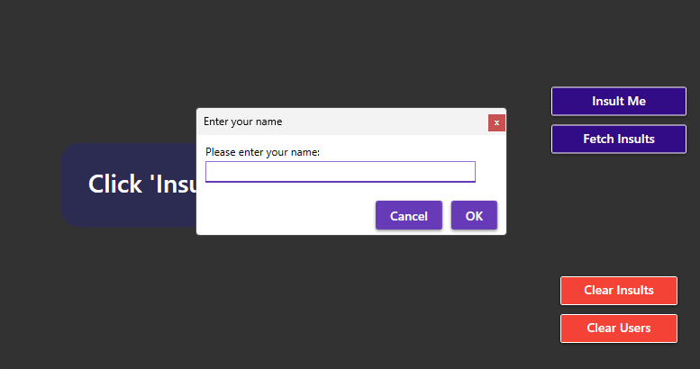
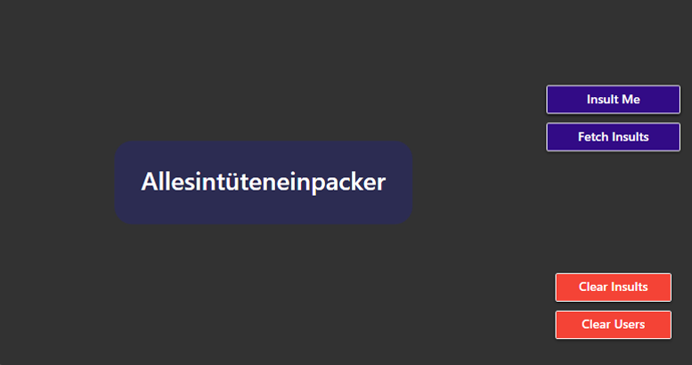
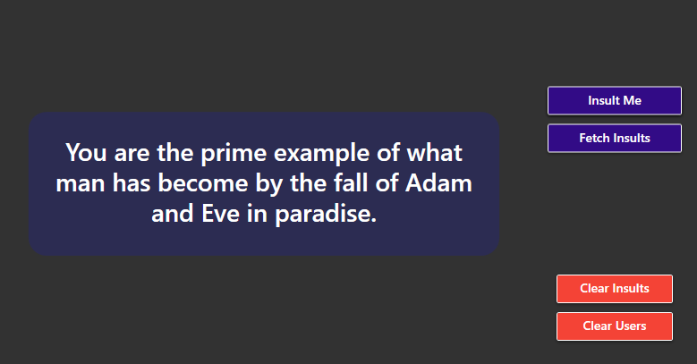

# Insult Generator – Lab 2

**Short description**  
A WPF application that lets the user generate, view, favourite, edit, and delete insults. All data is stored in a local SQL Server database using Entity Framework Code-First with migrations.

**Features**
  - Create: Add new insults
  - Delete: Remove insults
- At least two related tables:
  - `Insults`
  - `Users`
- Both tables are actively used in the app

**Database**
- Created automatically on first run (via EF migrations)
- Uses SQL Server (localhost) – database name: `insulter`

**How to run the project (tested on a clean machine)**

Release 1.0 is available in Releases

